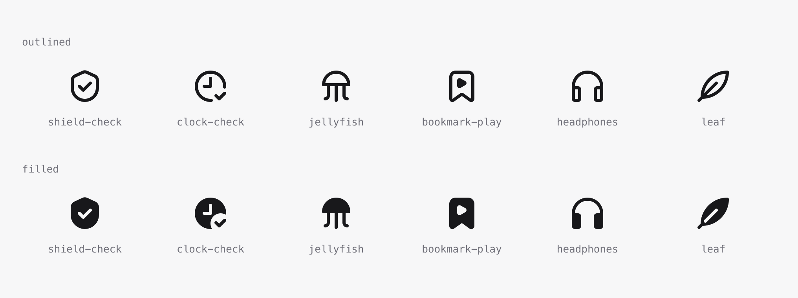

<div align="center">

# Iconsmith

**Draw SVG icons with coding agents and repeatable geometry**

Ask your agent for an icon. It draws alternatives, reviews them and exports an SVG.



<sub>Six concepts, both paints, selected from <a href="output/ten-icons-repaired-2026-09-09/">one run of ten</a> — the other four have contour defects. Regenerate the sheet with <code>npx tsx packages/iconsmith/scripts/showcase-sheet.ts</code>.</sub>

</div>

## Install

Requires Node.js 24.11 or newer and npm. Run from the repository:

```bash
git clone https://github.com/mblode/iconsmith.git
cd iconsmith
npm ci
npm run build:local
```

## Quickstart

Open this folder in Codex or Claude Code and send:

> Read examples/starter/AGENT.md and execute its drawing task.

The [brief](examples/starter/AGENT.md) runs parallel AI authors, independent visual
reviews and repairs using the included references. Use your own agent account
with subagent and image-viewing support. Unresolved defects leave the result as a
draft. The pipeline is not yet qualified as 10/10.

The default style is [blode-icons](examples/starter/README.md): the house library
is bundled under MIT. No private dataset or sibling repository is needed.

See [local setup](docs/local-setup.md) for the output files and troubleshooting.

## License

MIT

---

Crafted by [](https://blode.co) [Matthew Blode](https://blode.co)
