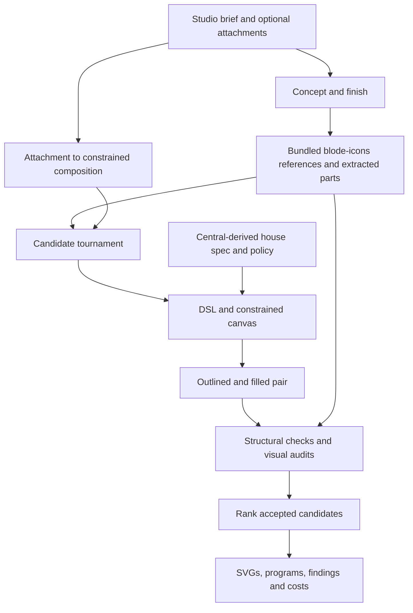
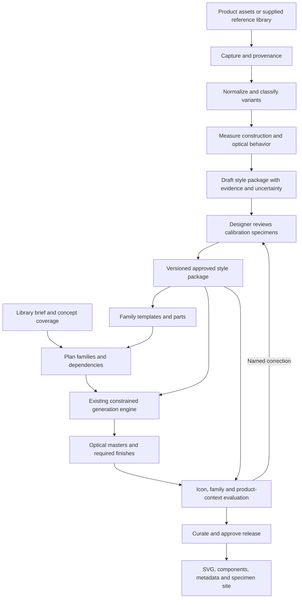

# Iconsmith: from house generator to icon foundry

> Historical discovery map. Execution order and acceptance rules are superseded by the [audited plan](plans/reference-guided-foundry.md) and [first-principles audit](plans/reference-guided-foundry.audit.md).
Research and code inspection: 5 September 2026. This is a current-state map and proposed architecture, not an implemented migration. Source inspection establishes behavior in this checkout; no paid generation or production acceptance run was performed.

The product should produce a maintained icon family: its design language, reusable constructions, optical masters, concept vocabulary, specimens, and releases. An individual SVG is one output of that system.

## Current pipeline

The generic engine additionally exposes BRIEF → PROPOSE → SELECT → DRAW → CHECK → SCORE as named, swappable stages. The production entry point is the Eve `generate_icon_pair` tool calling `generateStudioResponse`; it seats candidates in `runPairTournament`. These are related layers, not a claim that every Studio candidate traverses the same `runRoute` implementation.

| Layer | Verified implementation | Consequence |
| --- | --- | --- |
| Request | `packages/contract/src/types.ts:229`, `studioRequestSchema` | Text, finish, answers, annotations, up to four attachments and budget; no first-class style package or library version. |
| Attachment | `apps/agent/lib/generate.ts:234`, `visualProposal` | First usable image/SVG becomes `compose(..., {model: null})`. It guides composition; it does not install a design language. |
| References | `apps/agent/lib/arsenal.ts`, `loadStudioArsenal` | Loads bundled `data/house-icons.json`, selects house neighbors, extracts and names their parts. |
| Drawing | `apps/agent/lib/generate.ts:422` | Includes house analog, image-guided agent, tool agent and code-harness candidates; library candidates also exist. Budgets and reservations are already explicit. |
| Construction | `packages/iconsmith/src/tools/canvas.ts:200`, `Spec` and `specAt` | Configurable size, stroke and radius already exist, but derive from house constants. The design viewBox stays 24. This is variation within a house, not arbitrary style inference. |
| Routing | `packages/iconsmith/src/pipeline/route.ts` | Reusable stage boundaries; proposal and selection guards prevent generated free geometry from entering drawing. |
| Acceptance | `packages/iconsmith/src/pipeline/tournament.ts:399` | House derivation, complete programs, clean geometry and visual audits participate in acceptance. Replacing only the prompt leaves the old target in the judge. |
| Evaluation | `packages/iconsmith/src/eval/style.ts` | Neighborhood similarity with concept-closure exclusions and calibration already exists. Reuse the mechanism, recalibrate for each family. |
| Corpus policy | `packages/iconsmith/src/corpus/sources.ts`, `pipeline/licence.ts` | Source registry and branded references distinguish conditioning from analysis. The conditioning allowlist is explicitly house-specific. |
| Library surfaces | `apps/web/app/api/studio/library/route.ts`, `campaign/route.ts` | Iconify concept search and a generated campaign backlog already exist. Neither endpoint establishes a versioned multi-style foundry. |

The Central appearance is therefore systemic: source geometry, defaults, part vocabulary, routing choices, prompt policy and acceptance expectations reinforce one another. The canvas even documents an earlier attempt to apply Cursor-derived constants to Central, which misclassified Central's own drawings. A universal average style would repeat that mistake.

## Future pipeline

Keep the model choosing concepts, constructions, parts and named optical treatments. Keep geometry in deterministic tools and approved source parts. Broaden the compiler's supported construction vocabulary as evidence demands; do not enable arbitrary model-authored paths to claim support for any style.

“Any style” is a direction, not an immediate guarantee. Begin with monochrome product icon systems. Engraved, brush, textured, multicolor and illustrative families require additional representations and renderers. A profile must declare unsupported capabilities rather than silently approximate them with Central primitives.

## The central abstraction: a style package

This needs more than a token file. Proposed contents:

| Component | What it records |
| --- | --- |
| Identity and provenance | Source product, surface, capture date/version, original assets, content hashes and permitted uses. |
| Optical masters | Native design grids, target display ranges, keylines, overshoot, spacing, density and simplification rules per master. |
| Stroke and contour grammar | Caps, joins, corner construction, curvature families, angle conventions and permitted departures. |
| Optical corrections | Junction relief, local thinning, terminal treatment, dot roles, apparent centering and shape-dependent spacing. |
| Family grammar | Canonical folders, arrows, people, objects, badges, slash direction, attachment points and composition rules. |
| Finish grammar | Which variants exist; outline/solid relationships, counters, cuts and exceptions. A filled master need not be mechanically derived. |
| Approved vocabulary | Parts and family templates, all scoped to this style and master. |
| Evidence | Observations, distributions, sample counts, confidence, contradictory examples and reviewer decisions. Unknown values remain unknown. |
| Evaluation | Held-out concepts, approved specimens, family comparisons, context fixtures and style-specific calibration. |

Separate measured observations from approved rules. A modal radius does not prove a designer used one radius; a flattened filled contour does not uniquely reveal the original centerline. Inference should retain competing explanations until examples or review settle them.

Proposed runtime seam: a `StyleContext` carrying an immutable style version, optical master, allowed references, parts, construction rules and evaluator configuration. Pass it explicitly through reference retrieval, route context, canvas, twins, repairs and audits. The request selects a server-resolved style ID; a model-produced request must not invent its own approved profile or permissions. Include style and master hashes in caches and run records.

## Reference findings and extraction plan

### Cursor

The designer documents separate 16px/1.25px-stroke and 24px/1.5px-stroke masters; four optical shapes; predominantly rounded straight-segment construction; directional conventions; local thinning and junction cuts. This is useful evidence for a draft profile, but does not provide every coordinate, radius or exception. The article also documents family overviews and a maintained delivery pipeline. [Marek Minor's case study](https://www.minoradventures.co/blog/the-making-of-cursors-icons)

Capture the current product's actual font/SVG assets where available, with version, glyph mapping and variant identity. Keep the older Codicons set separate from the replacement. Treat illustrations in the article as design evidence, not a complete source library. Verify font-to-SVG conversion against rendered glyphs before measuring contours.

### OpenAI

Iconists lists OpenAI among its clients. That establishes authorship context, not a complete public product specification or an exportable icon library. [Iconists](https://iconists.co/)

Start with a named product surface and snapshot: for example, ChatGPT web on the capture date. Record Codex, marketing and other surfaces separately until measurement establishes whether they share a family. Capture SVGs, sprites or icon fonts plus their visible usage and state. Infer numerical rules only after inspecting those assets; no OpenAI stroke/radius values are asserted here.

### Twitter / X

A designer's case study documents maintaining two Twitter UI styles during the Iconists transition, alongside a separate presentation style. Historical Twitter and current X must therefore be distinct snapshots, not one merged reference set. [Griff L'Ecuyer's case study](https://griffdesigns.com/twitter)

Capture the current X product glyphs with navigation/action labels and active/inactive states. Exclude avatars, post media, logos and emoji from the product-icon population. Keep actual SVG geometry distinct from screenshots used to verify visual size and context.

### Central and Linear

Central advertises more than 2,000 symbols in 30 variants, demonstrating the value of a coordinated family with controlled variation. It remains the migration baseline, not the template imposed on other families. [Central](https://iconists.co/central)

The supplied Linear article concerns its 2024 UI redesign. Karri's linked post concerns a 2026 refresh: design exploration, agent-assisted prototyping, then internal product testing. These support a workflow of authored direction and contextual review; neither is a numerical icon specification. [2024 article](https://linear.app/now/how-we-redesigned-the-linear-ui), [2026 post](https://x.com/karrisaarinen/status/2032160761255284814)

### Acquisition contract

Use supplied SVG/Figma exports first when available; otherwise inspect product-delivered SVGs, sprites and fonts. Preserve originals before normalization. Resolve transforms and inherited paint, retain holes, deduplicate exact geometry, and attach semantic labels and states. Save screenshots separately for comparison. If only raster evidence exists, mark geometric measurements uncertain rather than presenting tracing as the original asset.

Each collection needs a manifest of captured assets and known missing surfaces. “All icons visible on this page” is not “the complete product library.” Record an explicit coverage boundary.

The current code allows only house references into conditioning. Replace that with explicit per-source usage policy when implementing multi-style support, preserving provenance and output notices. Do not relabel imported icons as house-authored to pass `asReference`. Extraction, analysis, conditioning and redistribution are separate capabilities in the proposed manifest; this is an architectural requirement, not a claim about the terms of any particular product.

## Library production and the quality bar

Plan a semantic coverage graph before batching generation. Define stable concept IDs, aliases, related families, required masters and state variants. Generate and approve parent constructions first, then derive their modifiers. A folder correction should identify every dependent icon and show its visual diff.

Use three distinct working views: explorations, family specimens, and approved releases. A library job pins its style version, uses resumable per-concept work with an aggregate budget, and keeps failed or declined items visible. Existing per-icon budgeting and run records are foundations, not a reason to launch an unbounded batch.

Proposed acceptance layers:

1. Geometry: valid SVG, real counters, complete programs and supported construction operations.
2. Style: native-master rules, part provenance and calibrated comparison with held-out references.
3. Family: matching recurring objects, badge placement, visual weight and declared finish relationships.
4. Semantics: recognition and distinctness of neighboring concepts; attractive geometry alone cannot pass.
5. Product: actual display sizes, light/dark backgrounds and surrounding typography.
6. Release: complete required coverage, stable names, reproducible exports, attribution and reviewed specimen diffs.

Report reconstruction, extension of a known family and genuinely novel concepts separately. Hold out concept closures across finishes and masters. Include wrong-style controls for the same concept and blind human review; embedding similarity alone cannot certify foundry quality. Thresholds must come from each family's calibration, not copied Central scores.

## Implementation sequence

| Step | Concrete deliverable | Exit condition |
| --- | --- | --- |
| 1. Package the current house | Central/blode style package and explicit runtime context | Current approved outputs and rejection behavior survive the refactor. |
| 2. Reference ingestion | Versioned collections, normalizer, measurements and evidence browser | Asset counts reconcile; original and normalized renders agree; missing coverage is named. |
| 3. One contrasting family | Draft and reviewed Cursor-style profile using acquired references | Same diagnostic concepts visibly follow the new construction language without Central leakage. |
| 4. Optical compiler | Profile-specific masters, named corrections and finish rules | Calibration specimens pass at intended display sizes; unsupported cases decline explicitly. |
| 5. Foundry workbench | Family planning, resumable jobs, specimen review and dependency diffs | An approved family can be extended and revised consistently with a bounded budget. |
| 6. Delivery | SVG/component exports, metadata, versioned specimen site; fonts/Figma export where required | A clean build reproduces a reviewed release with stable identifiers. |

Initial experiment proposal: the same 24 diagnostic concepts in the current house and one contrasting style, spanning simple marks, organic forms, dense junctions, modifiers and abstract concepts. This is a proposed test size, not an existing benchmark result. Add OpenAI and X as independent profiles after their assets and surface boundaries are established.

The decisive proof is a coherent new family under a different construction grammar, including novel concepts. Increasing icon count before proving that would scale the current limitation.

## What this research completed

Inspected the live references and current production orchestration, compiler specification, corpus policy, contract, library endpoints and evaluation seams. Verified Karri's post through the browser after the web reader could not load it. Computer History was running; the inspected segment did not add relevant evidence, so this map relies on direct sources. The standalone X profile pages were not used to infer specifications.

No complete Cursor, OpenAI or X asset library has been extracted in this mapping pass. No style profile has been fitted from those product assets, and no new generation capability is claimed. Those acquisition and compiler milestones are explicitly represented above.
