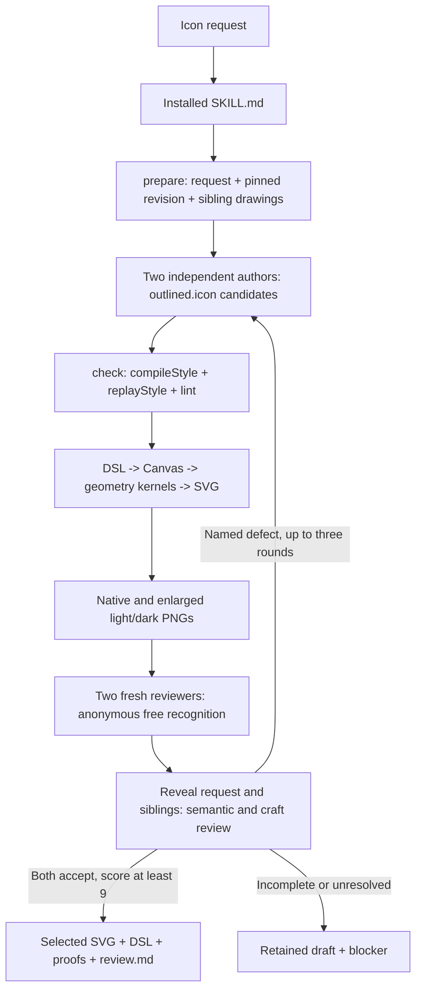
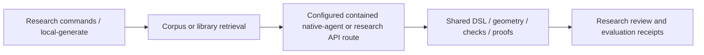

# Iconsmith pipeline

The product is a local CLI plus an agent skill. The agent supplies authoring and
visual judgement. The CLI supplies references, constrained geometry, exact replay,
previews and structural checks. A structural pass is not visual acceptance.

## Where changes belong

| Concept | Owner | Enforcement |
| --- | --- | --- |
| Public commands and machine output | `packages/iconsmith/scripts/agent-cli.ts` | Packed-install smoke, typecheck |
| Author/reviewer workflow and acceptance | `packages/iconsmith/SKILL.md` | Skill validation, recorded workflow scenarios; runtime cannot prove aesthetic approval |
| Reference selection | `scripts/library-siblings.ts`, `scripts/blode-icons.ts` in the package | Sibling lookup and source-admission tests |
| Revision and exact replay | `packages/iconsmith/src/pipeline/style.ts` | Revision, compiler and replay tests |
| Compile, snapshot and preview orchestration | `packages/iconsmith/scripts/style-check.ts` | Checker tests and packed-install smoke |
| Drawing language and geometry | `packages/iconsmith/src/tools/`, `src/geometry/` | Geometry/DSL tests and import-boundary check |
| Raster proofs | `packages/iconsmith/src/tools/proof.ts`, `render.ts` | Proof tests and installed render smoke |
| Structural diagnostics | `packages/iconsmith/src/tools/lint.ts` | Lint tests; never a visual-quality claim |

`draw`, `lint`, `render` and `schema` are direct local tools. They do not dispatch
models. `draw` uses its default spec or supplied parts; the skill uses `check` with
the prepared revision so it cannot silently substitute those defaults.

## Research tooling

The source checkout also builds a research CLI (`src/cli.ts` to `dist/cli.js`) and
runs the contained local generation entry (`scripts/local-generate.ts`). They use
shared geometry but have separate orchestration, corpus/evaluation utilities,
provider adapters and experimental controls. They are not installed by the npm
package's bin, which points to `dist-agent/cli.js`.

These are working entry points, not dead merely because they are outside the
public package. Retiring the research product would be a separate scope decision.
Historical receipts remain evidence, not runtime dependencies.

## Simplification and guardrails

The 2026-09-12 pass removed seven unintegrated modules and their private tests:
`acceptance-critic-evidence`, `ai-control-campaign-prep`, `campaign-forecast`,
`local-container-access-probe`, `local-parameter-search`, `quality-exposure`, and
`raster-proposal-feasibility`. Each had no non-test caller and no executable entry.
The removed slice contained 1,685 implementation and 1,242 test lines. Git history
retains the experiments. Plans mentioning them do not establish implemented
capability; restore one only alongside a real caller and its integration test.

`npm run check:dead` runs ordinary Knip and a runtime-only unused-file pass. The
latter excludes tests as roots, so a module cannot survive solely by testing
itself. Explicit `!` entry patterns in `knip.json` identify executable research
commands in production mode; built entry points are discovered by the tsdown
plugin. Do not add library helpers as entries to silence unused-file findings.
The same command runs in pre-commit and CI's `npm run verify` umbrella.

The public bundle remains small relative to the research tree. The highest-value
next simplification is moving its checking/revision orchestration to a clearly
owned runtime module when there is an actual second consumer; adding another
abstraction now would only move the same code. No new service, package, registry,
DI layer or bespoke dead-code scanner is needed.

## Verification

Run `npm run verify` for source changes, then `npm run check:package` for the
installed artifact. Cloud verification explicitly allows the absent private
corpus; local verification does not. `npm run check:public` tests the relocated
source starter. These establish functional contracts, not universal icon quality.
