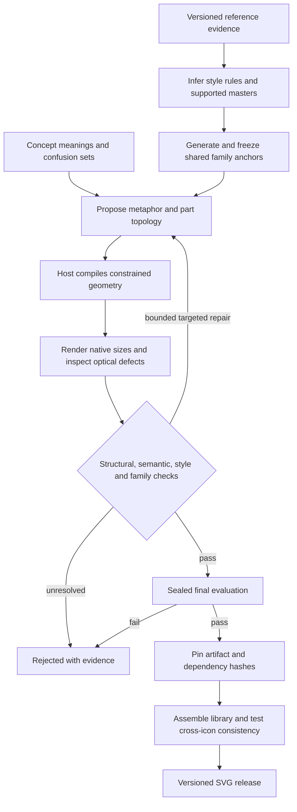

# Audit: can Iconsmith become an automated icon foundry?

> Surface update, 9 September 2026: the website, Studio, Eve service, shared Studio contract, and browser viewer were removed at the user’s request. References to them below are historical; use the root README and `docs/local-setup.md` for current local commands.

5 September 2026. Research and planning only. No generation benchmarks were run. This audit changes the [execution plan](reference-guided-foundry.md); it is not evidence that the proposed system already achieves the target quality.

## Verdict

The previous plan was stronger on reliable delivery than on creating excellent artwork. Its central unproven assumption was that a generalized style profile, constrained generator and independent AI judge would together produce foundry quality. Each can function correctly while the result remains mediocre.

Keep the deterministic compiler, source evidence, replay and release discipline. Change the first milestone to an end-to-end quality experiment, give the compiler explicit construction and optical capabilities, generate related icons as a family, and qualify the evaluator separately. Only then scale production.

The product requirement is zero human artwork intervention. It does not logically imply that an AI's self-assessment proves equivalence to professional designers. Automatic production and evidence of human-perceived quality are separate questions. External preference testing can evaluate a system without anyone drawing, correcting or approving its production icons.

## What the reference work actually establishes

Minor Adventures describes Cursor as separate 16px and 24px designs, with 1.25px and 1.5px strokes. The construction language includes rounded angular forms, repeated elements, local junction corrections and contextual checks. Some concepts have no filled counterpart. Its Figma organization separates exploration, system comparisons and final components. These are evidence for separate design decisions and a managed family, not a recipe that can simply be copied into a prompt. The work was manually drawn; the article does not demonstrate automated reproduction of its quality. [Cursor case study](https://www.minoradventures.co/blog/the-making-of-cursors-icons)

Central demonstrates coordinated variation across a large icon family. Iconists also identifies OpenAI and Twitter as clients, but that does not establish the complete asset population or numerical specification for a particular current product surface. [Central](https://iconists.co/central), [Iconists](https://iconists.co/)

**Design inference:** a foundry needs decisions about meaning, construction, apparent size, repeated forms, variants and evolution. An editor is one way to maintain those decisions. An automated system needs an equivalent explicit representation and feedback process.

## Load-bearing problems found in this checkout

| Severity | Verified fact | Consequence and resolution |
| --- | --- | --- |
| Critical | `pipeline/tournament.ts:406` treats any part operation or `construct` trace as house-derived; structural eligibility requires this. | A clean new primitive construction can be vetoed before judging. Replace the proxy with validated compiler operations and dependency provenance. A new icon need not contain copied geometry. Preserve this rule only in the explicitly pinned legacy house policy. |
| Critical | `pipeline/audit.ts:79` starts its rubric with house-specific 24px, 2px, half-grid and angle rules. `ICON_PX` is fixed at 24. | An otherwise generalized generator is still judged against Central. Generate the audit contract from selected style/master/context; freeze the old house rubric for its old calibration. |
| High | `PairTournamentOptions` has no Spec/Policy; replay defaults and `apps/agent/lib/arsenal.ts` house selection remain. | Thread a resolved revision through actual generation, candidate extras, repair, twins, auditing and cache identity. A selector alone proves little. |
| High | `tools/canvas.ts:259` derives optical cuts from house defaults; `Canvas.toSvg` emits round caps/joins. | Numeric style knobs do not represent all construction languages. Inventory supported topology, terminal, join, cut, local-width and master behavior before advertising a style. |
| High | `eval/judge.ts` tests shipped-correct against unrelated icons. | Useful semantic sanity check, insufficient evidence for quarter-unit optical differences or same-concept style fidelity. Add targeted instrument qualification. |
| High | `eval/style.ts` uses DINO neighborhood similarity. | Similarity is a signal, not a demonstrated disentanglement of style from concept. Test same concept/wrong style and different concept/right style separately. |

These are source observations, not reproduced output defects. Recheck line positions when implementation starts. The prior plan's permissions, immutable artifacts and uncertain-spend recovery remain valuable; they do not solve these quality gaps.

## First principles: what the generator must represent

An icon is a small visual statement inside a language. Model the decisions in this order:

1. **Meaning:** product action/state, intended metaphor, forbidden confusions, and related concepts. Two individually attractive icons can still be unusable if they mean nearly the same thing.
2. **Structure:** semantic parts, their topology and relations, silhouette class, permissible detail. A folder with a modifier is a family construction, not an unrelated prompt.
3. **Style:** how those structures are drawn: angular versus circular construction, terminals, corners, proportions, gap roles and treatment of overlap. Stroke width alone is insufficient.
4. **Optics:** corrections for the intended display size and context. Equal coordinate extents or equal ink area do not guarantee equal apparent size or weight.
5. **System:** shared generated bases, modifiers, master relationships, semantic aliases and release dependencies.

The AI chooses semantic structures and named bounded treatments. The host computes geometry and validates it. Preserve the invariant that the model never emits arbitrary coordinates, while recognizing that it guarantees construction discipline rather than taste. A solver may search declared style parameter ranges; it must not become an unconstrained path-coordinate escape hatch. Start with existing discrete operations and deterministic search. Add an optimizer only after a measured representation gap justifies it.

Keep native master units and a precise transform to any internal canonical canvas. A 24-unit internal representation can faithfully encode a 16-unit master; forcing the 16-unit design onto the existing house quantization cannot. Test transformed features and final rendering, not the viewBox label. Separate masters can use different topology; never assume filled output is a stroke expansion or that every concept requires every finish.

Style inference is underdetermined. A few screenshots cannot uniquely reveal hidden paths, intended proportions or rules for unseen objects. Store competing hypotheses, observed exceptions and missing capabilities. Choose additional diagnostic references that distinguish hypotheses. If uncertainty survives, support a narrower declared family instead of silently imposing house defaults.

## Proposed production loop

The arrows describe stages within existing modules, not new services or one agent per box. Generate anchors automatically from references, then reuse those generated constructions in siblings. Imported source geometry remains separately labeled. Do not demand an invented circle for every icon; require honest lineage and a newly synthesized concept construction, rather than returning the reference under a new name.

Repairs must identify a defect, affected semantic part, intended treatment and measurable result. Preserve the prior best valid candidate. Cap proposals and repair rounds per concept and stop cycles by program/artifact hashes. Local improvements must not worsen semantics or break family rules. Distinguish concept failure, grammar failure, optical failure and evaluator uncertainty; each needs a different next action.

## Research: generation and evaluation are different problems

| Primary source | What it supports | What it does not establish for Iconsmith |
| --- | --- | --- |
| [StarVector, CVPR 2025](https://arxiv.org/abs/2312.11556) | Multimodal SVG generation can use native primitives; pixel error alone misses vector quality. | Reference-guided house consistency across a complete product library. |
| [DuetSVG](https://arxiv.org/abs/2512.10894) | Joint visual/SVG modeling and visual guidance are promising generation approaches. | That its unconstrained SVG output obeys this compiler's invariant, or that an external raster proposal reproduces the same method. |
| [DiffVG](https://people.csail.mit.edu/tzumao/diffvg/) | Differentiable rasterization permits optimization of vector parameters. | A correct taste objective, metaphor selection or consistent optical masters. |
| [SVGenius](https://arxiv.org/abs/2506.03139) | Its benchmark finds complexity degradation and difficult style transfer. | An absolute ceiling on newer models or Iconsmith's constrained domain. |
| [SVGauge](https://arxiv.org/abs/2509.07127) | Domain-specific semantic/visual metrics correlate better with its human benchmark than generic alternatives. | A reference-free oracle for a new concept or a validated micro-optical acceptance threshold. |
| [SVG-Score](https://arxiv.org/html/2609.03806v1) | Controlled perturbations expose weak count/spatial sensitivity in general scores and uneven VLM judging; human alignment helps semantic evaluation. | A foundry-quality aesthetic evaluator. This is a 3 September 2026 preprint and its results are not independently reproduced here. |

Reading depth: full HTML methods and scope for SVG-Score; authors' abstracts/project descriptions for the other model/metric papers. The CVF DuetSVG PDF fetch returned 403, so no claims depend on unread full-paper details. None of these benchmarks was run locally. Do not import their reported rankings as a model choice for this task.

**Engineering decision:** first compare existing direct constrained generation with the existing visual-proposal-to-constrained-generation route under equal total budgets. Count proposal, selection, critique and failed calls. Both must produce executable constrained programs. Use identical references, concepts, render contexts and acceptance policy. Only retain an additional route if it improves held-out outcomes at a useful cost. Specialized model hosting, fine-tuning and DiffVG are deferred experiments, not initial dependencies.

## Qualify the instrument before trusting its verdict

Use separate non-compensating dimensions. A high style score cannot excuse an incorrect symbol or blocked counter.

| Dimension | Test |
| --- | --- |
| Geometry and export | Parse, paint, bounds, contours/counters, supported primitives, dependency provenance and exact replay. Use style-specific constraints; do not universally outlaw intentional overlaps. |
| Meaning | Unlabeled identification against a frozen confusion set; separately test whether the chosen metaphor fits product context. Avoid telling a judge the expected answer before asking what it sees. |
| Style | Correct-style examples across concepts; same-concept examples in competing styles; style-rule violations with intact meaning. |
| Optics | Render at intended CSS sizes, at 1× and 2× device scale, on light/dark surfaces and beside declared typography. Include nearest-neighbor enlarged pixel views as diagnostics, not substitutes for native-size evidence. |
| Family consistency | Compare shared base geometry after undoing placement transforms; badge roles, direction rules, cuts and master relationships; include near-duplicate semantic collisions. |
| Judge reliability | Known clean controls, declared defect controls, order reversals, repeated trials, abstentions and disagreement by defect type. Model difference alone does not prove statistical independence. |

The release judge receives the selected policy, necessary references and renderings, but not generator rationale, prior scores or candidate origin. Strip textual SVG metadata from the visual evidence. The repair judge can provide feedback; the sealed evaluation set cannot. Once sealed failures are used to change prompts/rules, that set becomes regression data and a fresh holdout is required.

Use gross defects, subtle declared-rule violations and harmless transformations. Synthetic perturbations only have known labels when they violate an explicit rule or semantic property. An arbitrary 0.25-unit edit is not automatically worse. Clean controls can also be ambiguous. Report abstention rather than manufacturing taste labels.

Suggested initial instrument gate, explicitly an engineering target: at least 20 distinct pairs per defect class, at least 90% correct ordering on rule-grounded defects, at most 10% false rejection on valid controls; report sample sizes and confidence intervals. Repeat order-swapped trials but do not count repetitions as independent examples. Unsupported defect classes prevent aesthetic auto-qualification for that capability. These targets detect a weak instrument; passing them does not prove professional taste. Freeze them before evaluation and never lower them retrospectively to admit a release.

## The smallest useful experiment

First artifact: a reproducible specimen report from one authorized contrasting reference collection and the house baseline, through the real engine/tournament, containing generated programs, SVGs, native renderings, raw verdicts, dependency hashes and spend. This is an end-to-end experimental slice. No selector, editor or batch infrastructure is required to learn whether it works.

Use the existing 24 concepts as a **diagnostic pilot**, not blanket style qualification. Partition into 12 development concepts and 12 sealed concepts across six declared morphology groups. Inside the sealed group distinguish:

- Six family-completion concepts: a base may be visible, but target variants and aliases are excluded from all conditioning/retrieval.
- Six novel-family concepts: entire related source families are excluded across masters and finishes.

The groups test different capabilities and must not be averaged into one claim. Freeze the actual roster and source hash closure before spending. Source availability may prevent a proposed concept from being a valid holdout; replace it before freezing, never after seeing failures. Public-source model memorization cannot be ruled out by local retrieval exclusions; label that limit and include new product-specific combinations.

Freeze advancement before running: the outcome is `pilot-proven` only when every predeclared pilot concept/required variant passes all hard gates and automated acceptance within its budget, generated outputs demonstrate each claimed capability, and the instrument passes for all required defect classes. Otherwise the outcome is `blocked`, with evidence. This demanding pilot gate is a decision to proceed, not population-level certification. A failed run may close the experiment ticket but cannot unlock ticket 03 or batch work. A narrower capability requires a newly declared experiment and fresh sealed evidence, not dropping failed cases after the fact.

Require all requested pilot items to have a verdict; preserve failures in the denominator. Record first-attempt success separately from success after repair. A successful pilot advances only its tested capabilities to Studio integration and a larger library trial. Every released manifest entry must pass its own hard gates and automated acceptance. The next trial samples new semantic families and real requested coverage; its roster and tolerances are frozen from pilot findings before running. Twenty-four successes cannot establish arbitrary-style support or a population defect rate for hundreds of dependent icons.

If the generator fails known constructions, fix the grammar before buying more candidates. If the judge misses known defects, fix or narrow evaluation before scaling. If individual icons pass but siblings drift, add family constraints before batch work. If all automatic checks pass, report automated acceptance honestly; a claim of equivalence to Iconists/Minor Adventures additionally needs blinded human-perception evidence. Such evaluation is not a required manual production step.

## Tool decision

Keep Iconsmith programs and generated masters authoritative, with SVG delivery. Glyphs 4's icon documents, masters and image exports are useful editor features, but they do not establish automatic reference-to-library design. Figma can show interface context; Glyphs can inspect curves and masters. Neither is required for this fully automated pipeline. [Glyphs 4 announcement](https://glyphsapp.com/news/glyphs-4-create-love-the-process)

## Review outcome

| Dimension | Before this audit | After plan corrections |
| --- | --- | --- |
| Completeness | 3 | 5 |
| Feasibility | 3 | 4 |
| Scope | 4 | 5 |
| Testability | 3 | 4 |
| Risk | 3 | 5 |
| Assumptions | 3 | 5 |

The corrected plan is ready for the bounded experiment, not for an unconditional world-class quality claim. Feasibility remains unverified for novel style construction. Testability remains limited by the absence of a validated evaluator for professional optical taste. These cannot honestly become 5/5 through prose. No implementation checks have been added or run in this audit.
