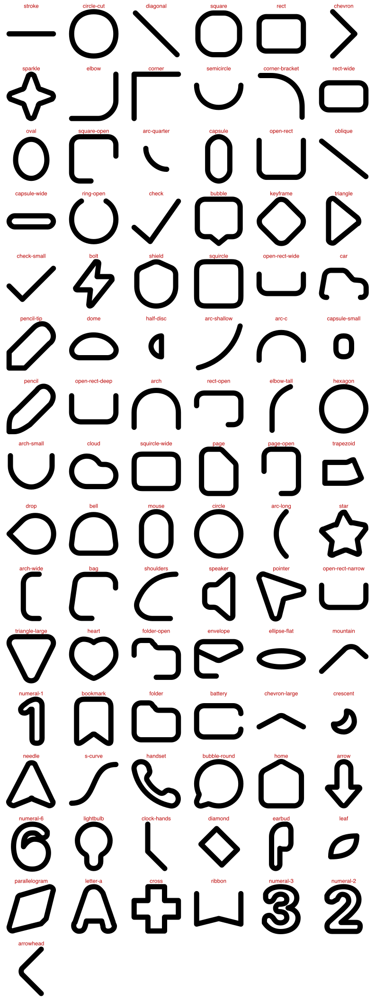

# The parts vocabulary

Generated by `scripts/vocabulary-sheet.ts` from a `iconsmith parts` extraction of 1106 parts, 91 of which a name reaches. The names themselves live in `src/parts/vocabulary.ts`, one entry per mark with the canonical drawing it was read off; `nameParts` matches them onto an extraction by shape, so they survive a re-run.

Read the sheet and the table together — every tile is labelled with the name in the row below. **⚠ marks a name to check before anything depends on it.**

| name | size | icons | instances | turns drawn | mirrored | example icons |
| --- | --- | --- | --- | --- | --- | --- |
| `stroke` | 6×0 | 764 | 1681 | 0/90/270 | 261/1681 | add-image, add-keyframe, add-to-basket |
| `circle-cut` ⚠ | 5×5 | 528 | 920 | 0/90/180/270 | 83/920 | add-image, add-to-basket, adjust-photo |
| `diagonal` | 4×4 | 215 | 428 | 0/90/180/270 | 174/428 | adjust-photo, american-football, animation |
| `square` | 4×4 | 133 | 147 | 0/90/180/270 | 42/147 | analytics, arrow-down-square, arrow-left-square |
| `rect` | 18×14 | 90 | 90 | 0/90/180/270 | 25/90 | alt, aspect-ratio-3-4, aspect-ratio-4-3 |
| `chevron` | 6×12 | 89 | 107 | 0/90/180/270 | 27/107 | apple-newton, arrow-corner-down-left, arrow-corner-down-right |
| `sparkle` | 8×8 | 61 | 75 | 0/180/270 | 13/75 | agentic-coding, ai-tokens, ai-translate |
| `elbow` | 5×5 | 44 | 51 | 0/90/180 | 40/51 | boolean-group-intersect-2, chart-compare, chart-compare-horizontal |
| `corner` | 5×5 | 41 | 55 | 0/90/180/270 | 39/55 | arrow, arrow-down-left, arrow-down-right |
| `semicircle` | 8×4 | 40 | 49 | 0/90/180/270 | 15/49 | apple-intelligence-icon, basketball, bell |
| `corner-bracket` | 4×4 | 36 | 108 | 0/90/180/270 | 14/108 | ar-scan-cube-1, arrows-all-sides-2, barcode |
| `rect-wide` | 18×11 | 30 | 30 | 0/90/180/270 | 8/30 | aspect-ratio-16-9, bag, bag-2 |
| `oval` | 3×3.75 | 28 | 44 | 0/180/270 | 18/44 | alien, audio, baymax |
| `square-open` ⚠ | 16×16 | 28 | 29 | 0/90/180/270 | 4/29 | add-image, boolean-group-intersect-3, boolean-group-substract |
| `arc-quarter` | 2×2 | 22 | 55 | 0/90/180/270 | 14/55 | airpod-right, banknote-2, book-heart |
| `capsule` | 4×8 | 22 | 23 | 0/90/180/270 | 1/23 | airdrop-2, back-10s, battery-loading |
| `open-rect` ⚠ | 6×5 | 22 | 23 | 0/90/180/270 | 5/23 | backpack, chart-2, fast-delivery |
| `oblique` ⚠ | 20×16 | 21 | 29 | 0/90/180/270 | 9/29 | airdrop-2, apple-newton, bean |
| `capsule-wide` | 12×3 | 19 | 23 | 0/90/180/270 | 16/23 | burger, calendar-check, calendar-repeat |
| `ring-open` | 18×16.5 | 19 | 20 | 0/90/180/270 | 9/20 | airdrop, arrow-rotate-clockwise, arrow-rotate-counter-clockwise |
| `check` | 5.5×5 | 19 | 20 | 0 | never | auto-correct, check-circle-2, check-circle-2-dashed |
| `bubble` | 16×16.54 | 18 | 18 | 0/180 | 11/18 | bubble-dots, bubble-heart, bubble-info |
| `keyframe` | 18.01×18.01 | 17 | 25 | 0/90/270 | 9/25 | add-keyframe, agents, coin-2 |
| `triangle` | 3.71×5.4 | 15 | 18 | 0/90/180/270 | 2/18 | airplay-audio, back, chevron-triangle-down-medium |
| `check-small` ⚠ | 5×3.5 | 15 | 15 | 0 | never | bell-check, bookmark-check, bubble-check |
| `bolt` | 5.49×6.69 | 15 | 15 | 0/180 | never | car-1-ev, car-10-ev, car-2-ev |
| `shield` | 16×18.23 | 15 | 15 | 0/90/270 | 3/15 | chat-bubble-7, chat-bubbles, shield |
| `squircle` | 16×16 | 14 | 14 | 0/180 | 4/14 | align-horizontal-center, align-vertical-center, compass-pointer-square |
| `open-rect-wide` ⚠ | 16×7 | 14 | 14 | 0/90/180/270 | 1/14 | arrow-box-left, bed, birthday-cake |
| `car` | 19.64×12 | 14 | 14 | 0 | 2/14 | car-1, car-1-ev, car-10 |
| `pencil-tip` ⚠ | 6.32×6.32 | 13 | 20 | 0/90/180/270 | 3/20 | bezier-edit, calendar-days, dumbell |
| `dome` | 13.62×7 | 13 | 13 | 0/180 | 4/13 | burger, emoji-grinning, emoji-smiling-face |
| `half-disc` | 1×2 | 12 | 21 | 0/90/180/270 | 7/21 | appearance-dark-mode, appearance-light-mode, emoji-smiley |
| `arc-shallow` ⚠ | 3.9×3.9 | 12 | 18 | 0/90/180 | 2/18 | american-football, animation-ease-in, animation-ease-out |
| `arc-c` ⚠ | 16×10 | 12 | 15 | 0/90/180/270 | 2/15 | arrows-show, beer, bug |
| `capsule-small` ⚠ | 1.5×2 | 12 | 14 | 0/180/270 | 9/14 | back-10s, crypto-wallet, focus-mode |
| `pencil` | 6.41×6.41 | 12 | 12 | 0 | never | calendar-edit, edit-big, highlight |
| `open-rect-deep` ⚠ | 14×8.27 | 12 | 12 | 0/90/180 | 2/12 | floppy-disk-2, gift-1, gift-box |
| `arch` ⚠ | 6×5 | 12 | 12 | 0/270 | 2/12 | crypto-coin, currency-euro, euro |
| `rect-open` ⚠ | 14×10 | 12 | 12 | 0/90/180/270 | 5/12 | bubbles, giro-cards, liquid-glass |
| `elbow-tall` ⚠ | 2×4.83 | 11 | 16 | 0/90/180/270 | 7/16 | arrows-repeat-right-left-off, calendar-clock, calendar-clock-4 |
| `hexagon` | 8×8 | 11 | 13 | 0/90/180/270 | 4/13 | anonymous, breakfast, package-security |
| `arch-small` ⚠ | 4×3 | 11 | 12 | 0/180/270 | 2/12 | airplay-audio, bag-2-sparkle, colors |
| `cloud` | 16×11 | 10 | 12 | 0/180 | 5/12 | cloud-simple, cloud-snow, cloud-weather |
| `squircle-wide` ⚠ | 18×14 | 10 | 10 | 0/90/180 | 6/10 | archive, camera-4, card |
| `page` | 14×18 | 10 | 10 | 0/90/180/270 | 1/10 | arrow-left-x, backward, direction-1 |
| `page-open` ⚠ | 14×18 | 10 | 10 | 0/270 | 8/10 | auto-size, page-add, page-cross |
| `trapezoid` ⚠ | 3.62×2.22 | 9 | 36 | 0/90/180/270 | never | keyboard-cable, keyboard-down, keyboard-up |
| `drop` | 11×9 | 9 | 11 | 0/90/180/270 | 5/11 | birthday-cake, drop, fire-2 |
| `bell` ⚠ | 16.08×14 | 9 | 10 | 0/90/180 | 3/10 | bell, bell-active, bell-check |
| `mouse` ⚠ | 10×15 | 9 | 10 | 0/90/180/270 | 6/10 | headphones, mouse, mouse-classic |
| `circle` | 18×18 | 8 | 11 | 0/90 | 2/11 | circle-ban-sign, coins, coins-add |
| `arc-long` ⚠ | 3×13.42 | 8 | 11 | 0/90/180/270 | 1/11 | email-notification, eye-closed, face-id-face |
| `star` | 5.27×5.14 | 8 | 10 | 0/180 | 4/10 | emoji-star-struck, magic-wand, make-it-pop |
| `arch-wide` ⚠ | 5×14 | 8 | 9 | 0/90/180/270 | 1/9 | calculator, code-insert, mailbox |
| `bag` | 13.1×13 | 8 | 8 | 0 | 1/8 | bag-2-sparkle, package-delivery-1, package-delivery-2 |
| `shoulders` | 6.9×8 | 8 | 8 | 0 | never | people-gear, people-sparkles, user-add |
| `speaker` | 10×15.73 | 8 | 8 | 0/180 | 1/8 | sound-fx, voiceover, volume-down |
| `pointer` | 8.73×8.73 | 7 | 7 | 0/90 | 1/7 | bezier-pointer, collaboration-pointer-left, collaboration-pointer-right |
| `open-rect-narrow` ⚠ | 16×8 | 7 | 7 | 0/270 | never | floppy-disk-1, reorder, store-4 |
| `triangle-large` ⚠ | 14×14 | 7 | 7 | 0/90/180/270 | 2/7 | arrow-triangle-bottom, arrow-triangle-left, arrow-triangle-right |
| `heart` | 6.5×5.78 | 6 | 6 | 0 | 1/6 | bubble-heart, heart, people-like |
| `folder-open` | 18×15 | 6 | 6 | 0 | never | folder-add-left, folder-bookmarks, folder-cloud |
| `envelope` | 18×14 | 6 | 6 | 0 | never | email-2-block, email-2-check, email-2-incoming |
| `ellipse-flat` ⚠ | 11×4 | 5 | 6 | 0/90/180/270 | 4/6 | coin-stack, globe, globe-2 |
| `mountain` ⚠ | 12×6.76 | 5 | 5 | 0/180 | 3/5 | images-1-alt, images-2, images-circle |
| `numeral-1` | 4.21×8.8 | 5 | 5 | 0 | never | back-10s, forwards-10s, gold-medal |
| `bookmark` | 14×18.06 | 5 | 5 | 0 | 2/5 | bookmark-check, bookmark-delete, bookmark-plus |
| `folder` | 18×15 | 5 | 5 | 0 | never | folder-1, folder-2, folder-open |
| `battery` | 17×12 | 5 | 5 | 0 | never | battery-empty, battery-error, battery-full |
| `chevron-large` ⚠ | 18×4.57 | 5 | 5 | 0/90/180/270 | never | chevron-large-down, chevron-large-left, chevron-large-right |
| `crescent` | 1.97×1.97 | 4 | 11 | 0/180 | 2/11 | golf-ball, kickball, moon |
| `needle` | 6.9×6.69 | 4 | 4 | 0/180 | 1/4 | compass-pointer, compass-pointer-square, initiatives |
| `s-curve` | 16×14 | 4 | 4 | 0 | never | animation-auto, animation-ease, bezier-curves |
| `handset` | 15.8×15.8 | 4 | 4 | 0 | never | call, call-incoming, call-outgoing |
| `bubble-round` | 18×18.03 | 4 | 4 | 0/90/180 | 1/4 | bubble-3, bubble-annotation-3, donut |
| `home` | 16×17.56 | 4 | 4 | 0/270 | never | form-pentagon, home-circle, home-plus |
| `arrow` | 13.87×19.16 | 4 | 4 | 0/90/180/270 | 1/4 | arrow-path-down, arrow-path-left, arrow-path-right |
| `numeral-6` | 7.1×8.88 | 4 | 4 | 0/180 | never | number-6-circle, number-6-square, number-9-circle |
| `lightbulb` | 14×19 | 4 | 4 | 0 | never | ear, light-bulb-simple, lightbulb-glow |
| `clock-hands` ⚠ | 2.5×6.5 | 4 | 4 | 0 | 1/4 | clock, clock-snooze, face-id |
| `diamond` | 3.41×3.41 | 3 | 10 | 0/90/180/270 | 3/10 | keyboard-down, keyboard-up, receipt-tax |
| `earbud` | 7×16 | 3 | 4 | 0 | 2/4 | airpod-left, airpod-right, airpods |
| `leaf` | 2.5×2 | 3 | 4 | 0/180 | 3/4 | alien, wreath, wreath-simple |
| `parallelogram` ⚠ | 6.58×6.58 | 3 | 3 | 0/180 | never | compass-round, compass-square, location |
| `letter-a` | 7.88×8.71 | 3 | 3 | 0 | never | alt, letter-a-circle, letter-a-square |
| `cross` | 8×8 | 3 | 3 | 0/270 | never | medical-cross, medical-cross-circle, medical-cross-square |
| `ribbon` | 8×5.5 | 3 | 3 | 0 | never | bronce-medal, gold-medal, silver-medal |
| `numeral-3` | 6.76×8.88 | 3 | 3 | 0 | never | bronce-medal, number-3-circle, number-3-square |
| `numeral-2` | 6.56×8.67 | 3 | 3 | 0 | never | number-2-circle, number-2-square, silver-medal |
| `arrowhead` | 5.59×12 | 1 | 2 | 0 | 1/2 | code-large |

_turns_ is the quarter-turns the set actually draws the mark at, and _mirrored_ how many of its instances are reflections. Both are measured, and both are the reason a name must not presume a direction: a mark drawn at four turns cannot be called `bottom-left-corner` and stay true.

## Names to check (29)

- **`circle-cut`** — circle with one chord flattened, which is what a circle looks like where something joins or knocks out of it — the magnifier lens meeting its handle, a share node meeting its arm. Named for the geometry because the icons do not agree on one object
- **`square-open`** — rounded square with one corner opened; boolean and bezier icons. 0.054 from the 12-unit cluster, which is the same mark
- **`open-rect`** — rounded rect with one side missing; the package and box body. Head of a family of about twenty clusters — see the family note
- **`oblique`** — a straight segment at an angle the house spec does not snap to (38 deg here). Six more clusters are the same mark at 27, 30, 51, 59, 66 and 68 degrees — the fingerprint of a bare segment barely varies with angle, so only the aspect bucket keeps them apart. The word goes to this one because 25 icons draw it against the next one's 23, and when the shape cannot choose the bearer, use is the only thing left that can; the other six are left unnamed rather than given six words for one mark
- **`check-small`** — sharper, smaller check mark. Same turn and flip evidence as `check`; probably its small size tier rather than a separate mark
- **`open-rect-wide`** — 2.3:1 open rect; bag and box bodies. Family member
- **`pencil-tip`** — `pencil` with the far end cut to a nib rather than rounded; 8 of its 10 icons are also edit marks. Flagged because the tip is the only thing separating it from `pencil`, and a model choosing between the two by name will not see that
- **`arc-shallow`** — a longer, shallower arc than `arc-quarter`, 0.047 from it — near enough that the fingerprint cannot separate them
- **`arc-c`** — the most curved member of the open-rect family; cup, coin and beer handles
- **`capsule-small`** — the smallest stadium tier; probably `capsule` rather than its own mark
- **`open-rect-deep`** — 1.7:1 open rect; gift, notebook, window. Family member
- **`arch`** — 6:5 arch; shopping-bag handles. Family member
- **`rect-open`** — landscape rounded rect with a corner opened; page-link, slides, picture-in-picture
- **`elbow-tall`** — a straight arm turning through a quarter circle at 1:2.4; clock hands, hourglass. Was `hook`, which named an object where the mark is a proportion of `elbow` — and only by eye, because the aspect gate refuses to measure the two against each other
- **`arch-small`** — 4:3 arch; the padlock shackle. Family member
- **`squircle-wide`** — the 16-node continuous-curvature treatment of `squircle` at 9:7; card, archive, sd-card. Flagged as the landscape tier of `squircle` rather than a mark of its own
- **`page-open`** — the page body with a gap where a badge sits; all 10 of its icons are page-, and all draw it at one turn. An open-rect family member, and 0.064 from the 8-icon cluster that draws the same thing — the word goes to the more used of the two rather than to both
- **`trapezoid`** — a quadrilateral with one pair of sides parallel; a key or panel seen in perspective, across keyboard- and layout-. Its transpose is a separate cluster at 2.22x3.62 that the aspect gate in `turnsToTry` refuses to compare against it, so the two are one mark the clusterer split — see the family note above
- **`bell`** — dome flaring to a wider flat base. Named from the mark rather than the icons: only 3 of its 9 are bell-, and it also serves as a cap, a trophy cup and an emoji mouth
- **`mouse`** — geometrically a 2:3 stadium — `capsule` at another proportion — and named from its icons instead: mouse, mouse-classic, mouse-scroll-. Flagged because the shape does not carry the word; 5 of its 9 icons are something else
- **`arc-long`** — a shallow arc over 4.5 times its own width; the cheek of a face, the closed eye. Same family as `arc-quarter` and `arc-shallow`, kept apart only by the aspect bucket
- **`arch-wide`** — 16:6 arch; server, garage, sofa. Family member, the turn where the closed side is the long one
- **`open-rect-narrow`** — 1:2 open rect; the battery terminal. Family member
- **`triangle-large`** — `triangle` at 14 units and equilateral rather than 3.7 and isosceles; arrow-triangle-, exclamation-triangle. Flagged as a size and proportion tier of `triangle`
- **`ellipse-flat`** — an ellipse near 3:1; the globe's equator and the rim of a stack seen edge-on. Flagged as a proportion tier of `oval` at 1:1.25 rather than a mark of its own — the aspect bucket is the only thing keeping them apart
- **`mountain`** — a low peak inside a frame; the mountain in a photograph. 3 of its 5 icons are images-, but subscription-tick-1 draws the same mark as a check, and at 12 units it is over twice `check`'s width — flagged because a model choosing by name will not see that second reading
- **`chevron-large`** — a chevron near 4:1, against `chevron`'s 2:1. The set's own word — 4 of its 5 icons are chevron-large- — but flagged as a size tier of `chevron` rather than a separate mark
- **`clock-hands`** — two arms of unequal length meeting at a sharp corner; the clock hands. 2 of its 4 icons are clock-, and the mark is geometrically `corner` with the arms in a 1:2.6 ratio, so the word describes the use rather than the shape
- **`parallelogram`** — a quadrilateral with both pairs of sides parallel; the compass face and the map plane, seen in perspective. Three icons is the floor this list stops at
